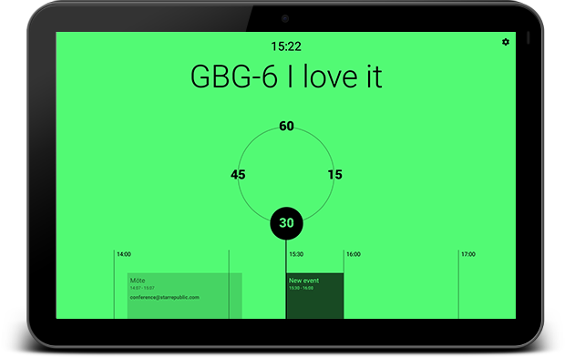

# Meetrix

## Introduction
Meetrix is an Android application which displays ongoing meeting information based from your Gsuite calendar room resources.

**Features:**
* Create a quick booking using the app
* View a timeline of bookings
* Quickly see if the room is free or occupied

## Installation
This section guides you through the installation process

**Requirements:**
* Any Android device running Android 4.1 (Jelly Bean) or later *(preferably a tablet)*
* Google G Suite *(formally Google apps for work)*

### Step 1
Create a new user to G Suite. This user should have access to calendar resources and not requre any pin for device. Use any email alias you like i.e conference@yourcompany.com

### Step 2
Download Meetrix app from Google play: #INSERT LINK#

### Step 3
Open the app and sign in with your new user i.e conference@yourcompany.com

### Step 4
Profit!

## Behind the scenes
This app containts a few modern Android development techniques:

* **Kotlin** as main language
* **Dagger2** for depencency injection
* **MVP**
* **RxKotlin**
* **DataBinding**

## Terms of use
This app may be used as pleased. However, it may not be sold or rebranded for profit use. You must give credit to Star Republic if using this app in your company.
